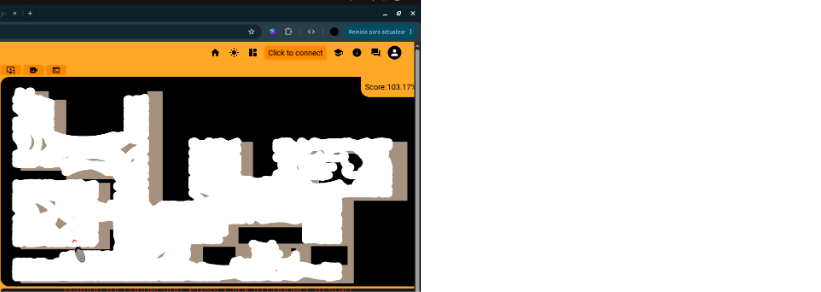

# PRÁCTICA 1: VACUUM CLEANER 

## Objetivos de la práctica

Como objetivo de esta práctica, debemos programar una aspiradora de gama baja para que recorra, de manera autónoma, la mayor parte del mapa posible. La lógica que debe seguir la aspiradora es girar de manera pseudo-aleatoria cuando choque con un obstáculo/pared.
Debe estar implementada una FSM como arquitectura de control. Esta debe contar mínimo con tres estados bien definidos.

## Solución encontrada

He probado varias soluciones hasta dar con la que me ha resultado más efectiva. Retroceder ante el choque antes de girar, no retroceder, mezclar giros y movimiento lineal, hacer espirales, movimientos en ese ... Al final he optado por una implementación basada en una FSM con los siguientes estados:
 - ***IDLE:*** Listo para empezar a moverse. Lo he introducido para asegurarme de que el láser ya está mandando información antes de empezar a ejecutar.
 - ***MOVING:*** Movimiento normal del robot. Realiza espirales hasta que choca la primera vez, después, debido a los obstáculos, realiza parábolas.
 - ***BUMP:*** Pone a cero tanto la velocidad lineal como la angular ante un choque.
 - ***SPINNING:*** Gira durante un número aleatorio de ticks, al lado contrario que gira el estado MOVING.
   
La mejor lógica que he encontrado al final es que haga una espiral hasta el primer choque, luego gira al lado contrario un número aleatorio de ticks y vuelve a moverse otra vez haciendo una parábola hacia el lado contrario. Con este bucle, dejando fija la velocidad angular y aumentando periodicamente la lineal (hasta un límite) he conseguido una máxima ejecución de 103.17% de recorrido del mapa.

A continuación dejo un vídeo demostración. Ha sido una ejecución de 19 minutos de duración y ha conseguido un 84% de puntuación.

[Vídeo demo](https://drive.google.com/file/d/1t12WhqmM5z1jBowxHswB1Vp1tjMVC7yG/view?usp=sharing)

## Problemas encontrados

La primera solución que encontré para generar un ángulo de giro aleatorio fue con la función *sleep*, pero al perder la reactividad durante el tiempo que dure el giro no era la más óptima. Al final he optado por contar un número de ticks aleatorios.

Otro problema con el que me he encontrado ha sido el aumento periódico de la velocidad lineal, ya que llegaba a una cifra que hacía que la aspiradora se desplazara de manera completamente lineal cuando yo buscaba una parábola. La solución que he encontrado a este problema ha sido definir una velocidad máxima y una mínima. Una vez el bucle llega a la máxima, resetea el valor al mínimo y comienza a incrementarla de nuevo.
